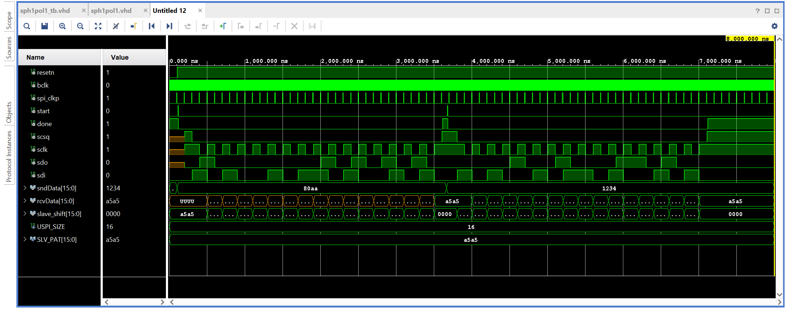
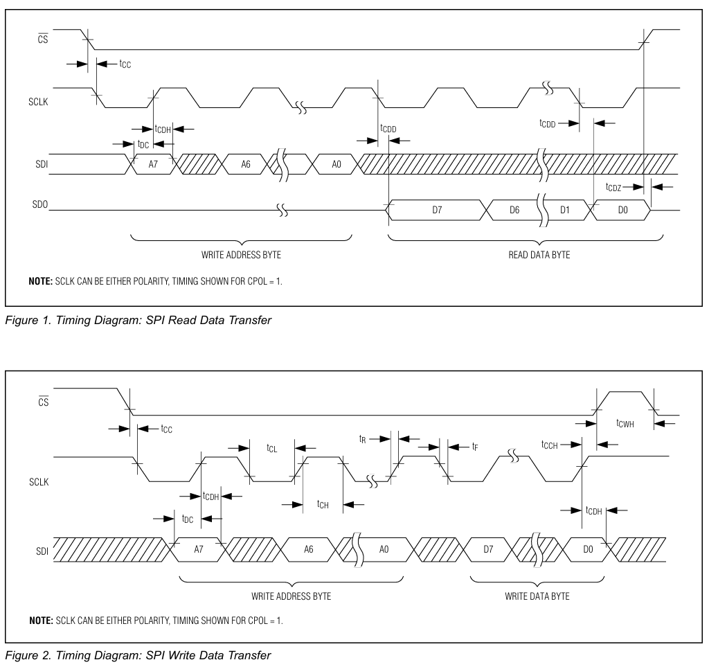

# SPI Master – Mode 3 (CPOL = 1, CPHA = 1) – VHDL

A standalone **SPI master controller written in VHDL** and configured for **SPI Mode 3** (CPOL = 1, CPHA = 1).

This design was originally developed as part of a larger FPGA-based system and later extracted into an independent project with a **fully working and robust testbench**. The implementation has been **validated in functional simulation** and is suitable for devices such as the **MAX31865 RTD-to-Digital Converter**.

---

## Key Features

* SPI **Mode 3** operation (CPOL = 1, CPHA = 1)
* Parameterizable transfer length via `USPI_SIZE` (default: 16 bits)
* MSB-first data transfer
* Clean `start` / `done` handshake
* Internal chip-select (`CS`) generation
* External SPI clock enable (`spi_clkp`) for flexible clock division
* Robust simulation testbench with a mock SPI slave
* No race conditions or `X` propagation in simulation

---

## Repository Structure

```
rtl/
  sph1pol1.vhd          # SPI master RTL (Mode 3)

tb/
  sph1pol1_tb.vhd       # Testbench with mock SPI slave

docs/images/
  sph1pol1_tb_behav.png # Vivado behavioral simulation waveform
  spi_timing_MAX31865.png
```

---

## Top-Level Interface

### Inputs

* `bclk` : System clock
* `spi_clkp` : SPI clock enable tick (FSM advances only when this is high)
* `resetn` : Active-low reset
* `start` : Transaction start request
* `sndData[USPI_SIZE-1:0]` : Transmit data (MOSI)
* `sdi` : Slave data input (MISO)

### Outputs

* `done` : Indicates idle / ready state
* `scsq` : Chip select (active low)
* `sclk` : SPI clock (idle high)
* `sdo` : Master data output (MOSI)
* `rcvData[USPI_SIZE-1:0]` : Received data (MISO)

---

## Design Overview

### Start / Done Wrapper FSM

A lightweight wrapper FSM ensures that each `start` request triggers **exactly one SPI transaction**. The `done` signal is asserted only when the SPI engine is fully idle, preventing retriggering or overlapping transfers.

### SPI Core FSM

The SPI core performs MSB-first transfers using a state machine synchronized to `bclk` and gated by the `spi_clkp` enable signal. This allows the SPI clock frequency to be controlled externally without modifying the core logic.

For Mode 3 operation:

* SCLK idles high (CPOL = 1)
* Data timing is aligned to CPHA = 1 behavior used in the target hardware system

---

## Testbench

The testbench (`sph1pol1_tb.vhd`) provides a complete and deterministic verification environment:

* 100 MHz system clock (`bclk`)
* Programmable SPI clock enable (`spi_clkp`)
* Synchronous `start` pulse generation
* **Single-driver mock SPI slave** (prevents multiple-driver conflicts)
* Correct edge alignment between master sampling and slave shifting

The mock slave returns a fixed pattern (`0xA5A5`) to verify correct reception.

Example console output:

```
RCV  = 0xA5A5
RCV2 = 0xA5A5
```

---

## Simulation Instructions (Vivado)

1. Create a new Vivado project
2. Add RTL source:

   * `rtl/sph1pol1.vhd`
3. Add simulation source:

   * `tb/sph1pol1_tb.vhd`
4. Set `tb_sph1pol1` as the simulation top
5. Run **Behavioral Simulation**

Expected behavior:

* `scsq` goes low during transfer
* `sclk` toggles and idles high
* `rcvData` matches the slave pattern (`0xA5A5`)

---

## Simulation Waveform

The following waveform shows a successful SPI transaction in Vivado:



---

## Timing Reference

The figure below shows the SPI timing diagram used as a reference (MAX31865, CPOL = 1):



---

## Customization

### Change Transfer Width

Modify the generic in `sph1pol1.vhd`:

```vhdl
GENERIC ( USPI_SIZE : INTEGER := 16 );
```

### Change SPI Clock Rate (Testbench)

Adjust the divider in the testbench:

```vhdl
constant DIV : integer := 10; -- one SPI tick every DIV bclk cycles
```

---

## Author

**Saeed Omidvari**
University of Bremerhaven

---

## License

MIT License
